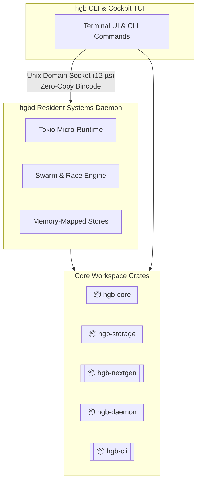

# Hagibis Architecture & Information Flow

Hagibis is designed as a **Systems-Grade Microkernel & Swarm Engine** for Vibe Code Developers, built entirely in **Rust** to provide sub-millisecond execution, zero context switching, and absolute model sovereignty.

## 🏗️ Systems Architecture: Dual-Engine Decoupling

At a macro level, Hagibis employs a **Dual-Engine Decoupling Architecture**, splitting its functionality into two high-performance binaries. They communicate via a Native Unix Domain Socket using a Zero-Copy Bincode Binary Protocol, achieving an IPC latency of ~12 µs.

1. **`hgb` (CLI & Cockpit TUI)**: The client-facing binary.
   - Extremely lightweight (sub-1MB).
   - Responsible for raw terminal mode, UI rendering, and capturing mouse/keyboard inputs.
   - Includes a differential card renderer for displaying chat canvases and code diffs.
2. **`hgbd` (Resident Systems Daemon)**: The background worker.
   - The core microkernel (Tokio-based micro-runtime) with minimal memory footprint (~8 MB RSS).
   - Manages the Swarm & Race Engine, memory-mapped stores, and long-running services like the HTTP mock server, browser CDP snooping, and file watchers.
   - Interfaces directly with Local (Ollama) and Cloud (Gemini) LLMs.

### Architectural Diagram

## 📦 Workspace Component Inventory

The Hagibis codebase is split into 5 modular Rust crates.

1. **`hgb-core` (The Microkernel)**
   - The fundamental building block. It handles external LLM interactions (Ollama Engine, Gemini API), manages data models (`StyleFeedbackRecord`, `SeedRecord`, `CrashRecord`), and exposes core `/api` endpoints via `ForgeEngine`.
2. **`hgb-storage` (Memory & Persistence)**
   - Depends on `hgb-core`. Handles SQLite memory mapping, SIMD vectors, cryptographic Blake3 Vault Ghost Envs, and stores `SkillRecord` entries.
3. **`hgb-nextgen` (Cognitive & Vibe Loop)**
   - Depends on `hgb-core` and `hgb-storage`. Manages autonomous capabilities like ChronoWarp 4D (Time Machine), AutoSpec, Context GC (`TurnRecord`), and the Cockpit TUI logic.
4. **`hgb-daemon` (`hgbd` Server)**
   - Depends on all the above crates. Implements the Epoll/Kqueue event loops and orchestrates incoming requests from the client.
5. **`hgb-cli` (`hgb` Client)**
   - Depends on all crates. Exposes the interactive REPL, CLI subcommands, and visual TUI rendering.

## 💾 Domain & Data Models

Information in Hagibis is persisted securely and rolled back atomically using CoW (Copy-on-Write) SQLite. Important data entities include:
- `StyleFeedbackRecord`: Tracks accepted coding conventions and styles.
- `SeedRecord`: Manages synthetic mock server configurations.
- `CrashRecord`: Captures error telemetry for self-healing intercepts.
- `SkillRecord`: Contains capabilities learned by the swarm.
- `TurnRecord`: Manages chat context memory.

## ⚡ External Services & Integrations

Hagibis implements a Dual-Brain Hybrid approach:
- **Offline Local Models**: Uses the Ollama Engine to interface with local models (e.g., Qwen, DeepSeek). This provides model sovereignty without vendor lock-in.
- **Frontier Cloud**: Integrates with the Gemini API for complex tasks requiring high reasoning capabilities.

By utilizing this architecture, Hagibis can dynamically arbitrate prompt vectors locally for speed and privacy, while escalating to cloud models only when necessary.