# Living Architecture Blueprint

> **Living Blueprint Auto-Generated by Hagibis**  
> Scanned `137` files | Discovered `19` components and `33` dependencies.

## 📐 Topology Visualizer

```mermaid
flowchart TB
    %% Living Architecture Blueprint generated by Hagibis
    subgraph Crates [Core Workspace Crates]
        crate_hgb_core[["📦 hgb-core"]]
        crate_hgb_storage[["📦 hgb-storage"]]
        crate_hgb_nextgen[["📦 hgb-nextgen"]]
        crate_hgb_daemon[["📦 hgb-daemon"]]
        crate_hgb_cli[["📦 hgb-cli"]]
    end

    subgraph DataModels [Domain & Data Models]
        entity_StyleFeedbackRecord[("💾 StyleFeedbackRecord")]
        entity_SeedRecord[("💾 SeedRecord")]
        entity_CrashRecord[("💾 CrashRecord")]
        entity_SkillRecord[("💾 SkillRecord")]
        entity_TurnRecord[("💾 TurnRecord")]
    end

    subgraph Endpoints [API & Service Endpoints]
        route_api_health["🌐 /api/health"]
        route_api_v1_items["🌐 /api/v1/items"]
        route_health["🌐 /health"]
        route_api_v1_status["🌐 /api/v1/status"]
        route_["🌐 /..."]
    end

    subgraph External [External Services & Integrations]
        svc_Ollama_Engine{"⚡ Ollama Engine"}
        svc_Gemini_API{"⚡ Gemini API"}
        svc_External_HTTP_API{"⚡ External HTTP API"}
        svc_Redis_Cache{"⚡ Redis Cache"}
    end

    %% Component Relationships
    crate_hgb_core -->|"calls"| svc_Ollama_Engine
    crate_hgb_core -->|"calls"| svc_Gemini_API
    crate_hgb_core -->|"calls"| svc_External_HTTP_API
    crate_hgb_core -->|"manages"| entity_StyleFeedbackRecord
    crate_hgb_core -->|"exposes"| route_api_health
    crate_hgb_core -->|"exposes"| route_api_v1_items
    crate_hgb_core -->|"exposes"| route_health
    crate_hgb_core -->|"exposes"| route_api_v1_status
    crate_hgb_core -->|"manages"| entity_SeedRecord
    crate_hgb_core -->|"exposes"| route_
    crate_hgb_core -->|"calls"| svc_Redis_Cache
    crate_hgb_core -->|"manages"| entity_CrashRecord
    crate_hgb_storage -->|"manages"| entity_SkillRecord
    crate_hgb_nextgen -->|"calls"| svc_Ollama_Engine
    crate_hgb_nextgen -->|"calls"| svc_Gemini_API
    crate_hgb_nextgen -->|"calls"| svc_External_HTTP_API
    crate_hgb_nextgen -->|"manages"| entity_TurnRecord
    crate_hgb_daemon -->|"calls"| svc_Gemini_API
    crate_hgb_daemon -->|"calls"| svc_Ollama_Engine
    crate_hgb_cli -->|"calls"| svc_Ollama_Engine
    crate_hgb_cli -->|"calls"| svc_Gemini_API
    crate_hgb_cli -->|"calls"| svc_External_HTTP_API
    crate_hgb_storage -->|"depends on"| crate_hgb_core
    crate_hgb_nextgen -->|"depends on"| crate_hgb_core
    crate_hgb_nextgen -->|"depends on"| crate_hgb_storage
    crate_hgb_nextgen -->|"depends on"| crate_hgb_daemon
    crate_hgb_daemon -->|"depends on"| crate_hgb_core
    crate_hgb_daemon -->|"depends on"| crate_hgb_storage
    crate_hgb_daemon -->|"depends on"| crate_hgb_nextgen
    crate_hgb_cli -->|"depends on"| crate_hgb_core
    crate_hgb_cli -->|"depends on"| crate_hgb_storage
    crate_hgb_cli -->|"depends on"| crate_hgb_nextgen
    crate_hgb_cli -->|"depends on"| crate_hgb_daemon
```

## 📦 Component Inventory

| Component | Type | Location | Description |
|-----------|------|----------|-------------|
| `hgb-core` | 📦 CRATE | `crates/hgb-core` | Rust crate: hgb-core |
| `hgb-storage` | 📦 CRATE | `crates/hgb-storage` | Rust crate: hgb-storage |
| `hgb-nextgen` | 📦 CRATE | `crates/hgb-nextgen` | Rust crate: hgb-nextgen |
| `hgb-daemon` | 📦 CRATE | `crates/hgb-daemon` | Rust crate: hgb-daemon |
| `hgb-cli` | 📦 CRATE | `crates/hgb-cli` | Rust crate: hgb-cli |
| `Ollama Engine` | ⚡ SVC | `crates/hgb-core/src/lib.rs` | External dependency accessed via crates/hgb-core/src/lib.rs |
| `Gemini API` | ⚡ SVC | `crates/hgb-core/src/lib.rs` | External dependency accessed via crates/hgb-core/src/lib.rs |
| `External HTTP API` | ⚡ SVC | `crates/hgb-core/src/auth/gemini_oauth.rs` | External dependency accessed via crates/hgb-core/src/auth/gemini_oauth.rs |
| `StyleFeedbackRecord` | 💾 ENTITY | `crates/hgb-core/src/style.rs` | Data model in crates/hgb-core/src/style.rs |
| `/api/health` | 🌐 ROUTE | `crates/hgb-core/src/forge.rs` | HTTP Endpoint in crates/hgb-core/src/forge.rs |
| `/api/v1/items` | 🌐 ROUTE | `crates/hgb-core/src/forge.rs` | HTTP Endpoint in crates/hgb-core/src/forge.rs |
| `/health` | 🌐 ROUTE | `crates/hgb-core/src/forge.rs` | HTTP Endpoint in crates/hgb-core/src/forge.rs |
| `/api/v1/status` | 🌐 ROUTE | `crates/hgb-core/src/forge.rs` | HTTP Endpoint in crates/hgb-core/src/forge.rs |
| `SeedRecord` | 💾 ENTITY | `crates/hgb-core/src/seed_engine.rs` | Data model in crates/hgb-core/src/seed_engine.rs |
| `/...` | 🌐 ROUTE | `crates/hgb-core/src/blueprint.rs` | HTTP Endpoint in crates/hgb-core/src/blueprint.rs |
| `Redis Cache` | ⚡ SVC | `crates/hgb-core/src/blueprint.rs` | External dependency accessed via crates/hgb-core/src/blueprint.rs |
| `CrashRecord` | 💾 ENTITY | `crates/hgb-core/src/shell_hook.rs` | Data model in crates/hgb-core/src/shell_hook.rs |
| `SkillRecord` | 💾 ENTITY | `crates/hgb-storage/src/skills.rs` | Data model in crates/hgb-storage/src/skills.rs |
| `TurnRecord` | 💾 ENTITY | `crates/hgb-nextgen/src/context_gc.rs` | Data model in crates/hgb-nextgen/src/context_gc.rs |

## 🔗 Inter-Component Dependencies

| Source | Relationship | Target |
|--------|--------------|--------|
| `crate_hgb_core` | *calls* | `svc_Ollama_Engine` |
| `crate_hgb_core` | *calls* | `svc_Gemini_API` |
| `crate_hgb_core` | *calls* | `svc_External_HTTP_API` |
| `crate_hgb_core` | *manages* | `entity_StyleFeedbackRecord` |
| `crate_hgb_core` | *exposes* | `route_api_health` |
| `crate_hgb_core` | *exposes* | `route_api_v1_items` |
| `crate_hgb_core` | *exposes* | `route_health` |
| `crate_hgb_core` | *exposes* | `route_api_v1_status` |
| `crate_hgb_core` | *manages* | `entity_SeedRecord` |
| `crate_hgb_core` | *exposes* | `route_` |
| `crate_hgb_core` | *calls* | `svc_Redis_Cache` |
| `crate_hgb_core` | *manages* | `entity_CrashRecord` |
| `crate_hgb_storage` | *manages* | `entity_SkillRecord` |
| `crate_hgb_nextgen` | *calls* | `svc_Ollama_Engine` |
| `crate_hgb_nextgen` | *calls* | `svc_Gemini_API` |
| `crate_hgb_nextgen` | *calls* | `svc_External_HTTP_API` |
| `crate_hgb_nextgen` | *manages* | `entity_TurnRecord` |
| `crate_hgb_daemon` | *calls* | `svc_Gemini_API` |
| `crate_hgb_daemon` | *calls* | `svc_Ollama_Engine` |
| `crate_hgb_cli` | *calls* | `svc_Ollama_Engine` |
| `crate_hgb_cli` | *calls* | `svc_Gemini_API` |
| `crate_hgb_cli` | *calls* | `svc_External_HTTP_API` |
| `crate_hgb_storage` | *depends on* | `crate_hgb_core` |
| `crate_hgb_nextgen` | *depends on* | `crate_hgb_core` |
| `crate_hgb_nextgen` | *depends on* | `crate_hgb_storage` |
| `crate_hgb_nextgen` | *depends on* | `crate_hgb_daemon` |
| `crate_hgb_daemon` | *depends on* | `crate_hgb_core` |
| `crate_hgb_daemon` | *depends on* | `crate_hgb_storage` |
| `crate_hgb_daemon` | *depends on* | `crate_hgb_nextgen` |
| `crate_hgb_cli` | *depends on* | `crate_hgb_core` |
| `crate_hgb_cli` | *depends on* | `crate_hgb_storage` |
| `crate_hgb_cli` | *depends on* | `crate_hgb_nextgen` |
| `crate_hgb_cli` | *depends on* | `crate_hgb_daemon` |
