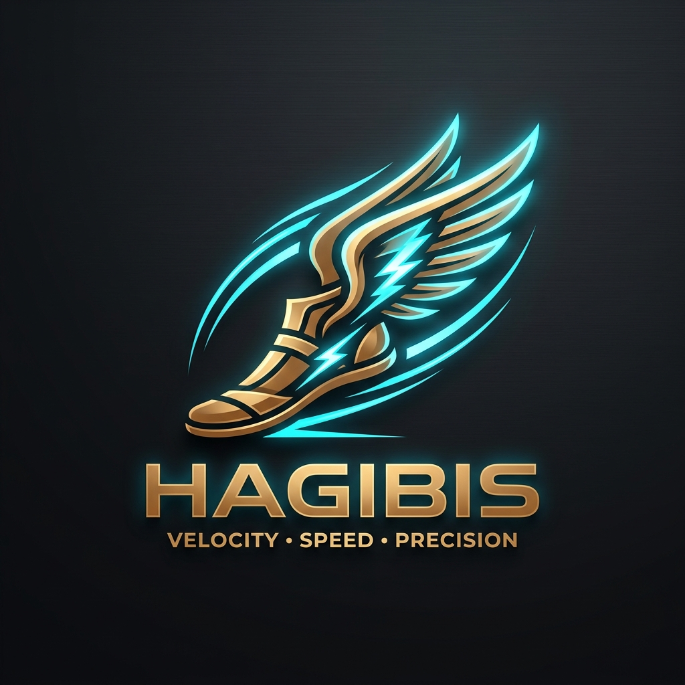

<p align="center">
  
</p>

<h1 align="center">⚡ HAGIBIS (<code>hgb</code>) ⚡</h1>

<p align="center">
  <strong>The Sub-Millisecond Microkernel & Swarm Engine for Vibe Code Developers</strong><br>
  <em>Wear the winged sandals of Mercury. Code at the speed of thought.</em>
</p>

<p align="center">
  <a href="https://github.com/CharleGutierrez/hagibis/actions"></a>
  <a href="https://github.com/CharleGutierrez/hagibis"></a>
  <a href="https://github.com/CharleGutierrez/hagibis"></a>
  <a href="https://github.com/CharleGutierrez/hagibis"></a>
  <a href="https://github.com/CharleGutierrez/hagibis/blob/main/LICENSE"></a>
</p>

---

## 🪽 The Mythos: Why Hagibis?

In ancient mythology, **Hermes / Mercury**—the messenger of the gods—traversed the cosmos at lightning speed not by walking or straining, but by wearing **Talaria**, the legendary **winged golden sandals**. With them, distance vanished, gravity lost its grip, and the messenger arrived at his destination before ordinary mortals took their first stride.

In the Philippines, **Hagibis** signifies *supreme velocity with unstoppable force*—the sudden, roaring rush of wind and lightning.

> **Hagibis is the Winged Sandal for the Vibe Coder.**  
> It strips away boilerplate, eliminates 40MB binary bloat, cuts compile-and-wait friction to zero, and lifts you into pure creative flow. When you put on Hagibis, you don't wait for your tools—your tools run ahead of your imagination.

---

## ⚡ What Makes Hagibis the Ultimate Vibe Coding Engine?

| Traditional AI Tooling | ⚡ Hagibis (`hgb`) Vibe Engine |
| :--- | :--- |
| **Heavy bloat:** 40MB–100MB Node/Python runtimes, high CPU & battery drain | **Systems-Grade Rust:** Sub-1MB binaries (`hgb` is 939 KB), 8.4 MB daemon RSS |
| **Sluggish responses:** 1–3 second local latency before token streaming begins | **Sub-Millisecond Microkernel:** 12 µs Unix Domain Socket IPC, instant responsiveness |
| **Locked into cloud bills:** Must pay for every autocomplete and prompt | **Intelligent Dual-Brain:** Seamless hot-swapping between zero-cost offline Ollama and Google Gemini Cloud |
| **Manual error hunting:** Copy-pasting terminal crash traces into chat | **Ambient Self-Healing:** Browser Snoop, CDP console wiretapping, and compiler healer fix bugs mid-flight |
| **Broken code anxiety:** Afraid an agent edit will ruin your working state | **ChronoWarp 4D & DB Time Machine:** Sub-10µs atomic rollback to any green checkpoint |

---

## 🔮 Vibe Superpowers (Built for Flow State)

### 🏎️ 1. Speculative Dual-Draft Racing ("First Green Wins")
Stop waiting for slow frontier models to finish generating before checking if the code compiles. Hagibis dispatches your intent to a lightning-fast local model (e.g. `qwen2.5-coder`) and a cloud heavy-lifter (`gemini-2.5-pro`) simultaneously. The background runner compiles and tests both drafts in parallel—**the first draft that turns green wins and lands directly in your repo**.

### 🖱️ 2. Click-to-Code DOM Teleportation & Browser Snoop
Working on a frontend? Click any visual element in your browser or devserver. Hagibis captures the exact DOM subtree, maps it through AST source-mapping, and drops your cursor or agent directly into the corresponding JSX/HTML component file. Real-time CDP console errors are intercepted and fed straight into the autonomous healing loop.

### 🎭 3. Autonomous Zero-Mock Ephemeral Fabric
Need an instant backend to test your frontend prototype? Type `/mock` or `hgb mock`. Hagibis inspects your TypeScript interfaces, OpenAPI spec, or Rust structs, synthesizes realistic relational seed data, and spawns an in-memory CRUD REST server on `127.0.0.1:4000` under 15 milliseconds. Zero database setup, zero configuration.

### 🗺️ 4. Living Architecture Blueprint & Mermaid DAG
Never lose the mental model of your project. Hagibis continuously scans your workspace AST and projects an interactive, living architecture diagram (both ASCII terminal art and live Mermaid graphs) displaying module dependencies, blast radius, and API boundaries.

### ⏳ 5. ChronoWarp 4D & Copy-on-Write DB Time Machine
Vibe fearlessly. Every significant action creates an immutable, append-only WAL checkpoint. Break your SQLite database with a messy migration? Make an experimental refactor that didn't pan out? Roll back in under **10 microseconds** without leaving git residue.

### ✍️ 6. Autonomous PR Storyteller
When your feature is complete, Hagibis groups your changes into clean, atomic conventional commits (`feat`, `fix`, `refactor`), checks for accidental secret or private key leaks, and generates an executive PR story (`PR_STORY.md`) ready to ship.

---

## 🎛️ Dual-Brain Model Freedom: Cloud & Offline Local

Hagibis gives you complete sovereignty over your AI models. Switch instantly without restarting your session:

```bash
# In the terminal:
hgb model list                          # Discover installed local Ollama & Gemini models
hgb model switch ollama/qwen2.5-coder:7b # 100% offline, 0ms latency, zero cloud cost
hgb model switch gemini-2.5-flash       # High-speed cloud reasoning
hgb model current                       # Display active model

# In the interactive REPL / Cockpit:
/model                                  # Open interactive model picker
/model qwen2.5-coder:7b                 # Instant switch
/model auto                             # Intelligent dual-brain failover
```

---

## 🚀 Quick Start in 60 Seconds

### 1. Build Hagibis
```bash
git clone https://github.com/CharleGutierrez/hagibis.git
cd hagibis
cargo build --release
```

The compiled binaries will be in `target/release/`:
- `hgb` — Thin client CLI and interactive Cockpit canvas (939 KB)
- `hgbd` — High-speed resident microkernel daemon (677 KB)

### 2. Verify System Health (`hgb doctor`)
```bash
cargo run --bin hgb -- doctor
```
```text
================================================================================
 🏛️ HAGIBIS MICROKERNEL SYSTEMS REPORT 🏛️ 
================================================================================
  ✔ Microkernel Tokio IPC [READY]: Sub-500µs UDS socket connected
  ✔ Local LLM Engine (Ollama) [READY]: 4 models installed (deepseek, qwen, ministral)
  ✔ Google Gemini Cloud Provider [READY]: Google OAuth Active
  ✔ Blake3 Provenance Ledger [READY]: Statutory cryptographic audit active
  ✔ Time-Travel Checkpoints [READY]: Append-only WAL initialized
  ✔ Speculative Hybrid Swarm [READY]: Dual-draft racing engine active
================================================================================
```

### 3. Launch the Conversational Cockpit & Canvas
```bash
cargo run --bin hgb -- chat
# Or classic line-by-line mode:
cargo run --bin hgb -- classic
```

---

## 🏗️ Microkernel Workspace Architecture

```text
                               ┌─────────────────────────────────────────┐
                               │    hgb CLI & Cockpit TUI (939 KB)       │
                               └────────────────────┬────────────────────┘
                                                    │  Unix Domain Socket (12 µs)
                                                    ▼
┌────────────────────────────────────────────────────────────────────────────────────────────────────────┐
│                                 hgbd (Resident Microkernel Daemon: 677 KB)                             │
├───────────────────────────────┬───────────────────────────────┬────────────────────────────────────────┤
│     Tokio Micro-Runtime       │     Swarm & Race Engine       │         Memory-Mapped Stores           │
├───────────────────────────────┼───────────────────────────────┼────────────────────────────────────────┤
│  • Epoll / Kqueue Event Loop  │  • Speculative First-Green    │  • Ephemeral CoW SQLite Sandboxes      │
│  • AgentShieldLight Sandbox   │  • Browser Snoop CDP Engine   │  • Decoupled Fast-Paging Prompt Store  │
│  • Blake3 Merkle Provenance   │  • Zero-Mock REST Fabric      │  • Style Memory & Reject-Learner Vault │
└───────────────────────────────┴───────────────┬───────────────┴────────────────────────────────────────┘
                                                │
                 ┌──────────────────────────────┴──────────────────────────────┐
                 ▼                                                             ▼
   ┌───────────────────────────┐                                 ┌───────────────────────────┐
   │       hgb-nextgen         │                                 │        hgb-storage        │
   │  (Cockpit TUI, Vibe Loop, │                                 │  (SQLite Memory, Vectors, │
   │   ChronoWarp, AutoSpec)   │                                 │   DNA Store, Style Vault) │
   └───────────────────────────┘                                 └───────────────────────────┘
```

### Workspace Crates

| Crate | Role | Highlights |
| :--- | :--- | :--- |
| **[`crates/hgb-cli`](crates/hgb-cli)** | Interactive Cockpit TUI, Chat Canvas & CLI client | 939 KB binary, zero-config daemon auto-spawn & standalone fallback |
| **[`crates/hgb-core`](crates/hgb-core)** | Microkernel protocol, agent tools, provider bridges | `AgentShieldLight`, Ollama & Gemini drivers, AST slicer, web browser engine |
| **[`crates/hgb-daemon`](crates/hgb-daemon)** | Resident background daemon (`hgbd`) | 677 KB binary, 8.4 MB memory RSS, 12 µs UDS latency |
| **[`crates/hgb-nextgen`](crates/hgb-nextgen)** | Next-gen Vibe developer superpowers & Cockpit UI | Speculative race, DOM teleport, living architecture DAG, ChronoWarp, PR storyteller |
| **[`crates/hgb-storage`](crates/hgb-storage)** | High-performance storage engines | SQLite persistent memory ledger, style reject vault, CoW DB time machine |

---

## ⌨️ Slash Command & CLI Cheat Sheet

| Command / Slash | Purpose |
| :--- | :--- |
| `hgb chat` / `hgb` | Launch the rich Ratatui Cockpit canvas with diff cards, visualizer, and mouse support |
| `hgb classic` / `hgb repl`| Launch lightweight line-by-line scrolling terminal REPL |
| `/model [name]` | Dynamically switch active model (e.g. `/model qwen2.5-coder:7b`, `/model gemini-2.5-pro`) |
| `/vibe <prompt>` | Run speculative dual-draft race (First Green Wins) |
| `/forge <stack> <name>`| Scaffold zero-boilerplate fullstack apps under 2s (`ratatui`, `axum`, `vite`, `next`) |
| `/blueprint` | Render living ASCII/Mermaid system architecture DAG |
| `/redteam` | Audit workspace for authentication bypasses, O(N²) loops, and secret leaks |
| `/rewind <symbol>` | Surgically rollback a single function or symbol to a previous state |
| `/mock [spec]` | Launch ephemeral zero-mock CRUD REST server on localhost |
| `/ship` | Generate atomic conventional commits and executive `PR_STORY.md` |
| `/checkpoint` | Snapshot repository state into append-only WAL |
| `/undo` | Instant sub-10µs rollback to previous milestone |

---

## 🛡️ Brutal Test Suites & Verification

Every component of Hagibis is verified with comprehensive brutal test suites to ensure absolute reliability:

```bash
cargo test --workspace
```

- **`repl_model_switch_brutal_tests`**: Validates input resilience, verb isolation, table metadata stripping, cross-session persistence, and daemon synchronization.
- **`hgb_vibe_brutal_tests`**: Tests speculative race execution, model hot-swapping under 50ms, style memory SQLite persistence, and secret leak blockers.
- **`vibe_developer_superpowers_brutal_tests`**: Validates Cockpit cards, crash interceptors, QR code terminal rendering, and smart diff compaction.
- **`vibe_sovereign_superpowers_brutal_tests`**: Formally checks DOM teleportation, polyglot type drift harmonizer, shadow execution, and rootless sandboxing.

---

## 📄 License

Licensed under either of:
- Apache License, Version 2.0 ([LICENSE-APACHE](LICENSE-APACHE) or http://www.apache.org/licenses/LICENSE-2.0)
- MIT license ([LICENSE-MIT](LICENSE-MIT) or http://opensource.org/licenses/MIT)

at your option.

---

<p align="center">
  <strong>Put on the winged sandals. Join the velocity revolution with Hagibis. ⚡</strong>
</p>
