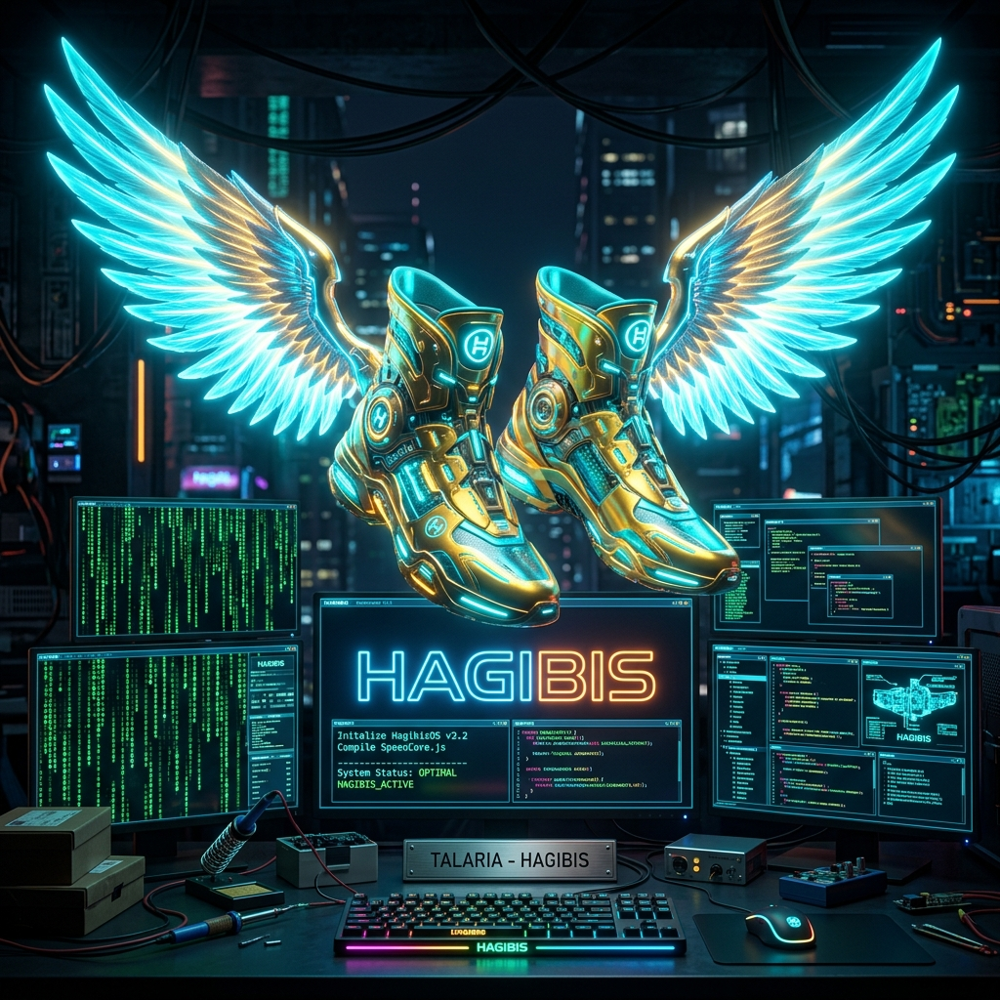

<p align="center">
  
</p>

<h1 align="center">🪽 HAGIBIS (<code>hgb</code> & <code>hgbd</code>) 🪽</h1>

<p align="center">
  <strong>The Sub-Millisecond Systems Microkernel, Swarm Engine & 125 Sovereign Superpowers for Vibe Code Developers</strong><br>
  <em>Wear the winged sandals of Talaria. Code at the speed of thought.</em>
</p>

<p align="center">
  <a href="https://github.com/CharleGutierrez/hagibis/actions"></a>
  <a href="https://github.com/CharleGutierrez/hagibis"></a>
  <a href="https://github.com/CharleGutierrez/hagibis"></a>
  <a href="https://github.com/CharleGutierrez/hagibis"></a>
  <a href="HAGIBIS_VIBE_CODING_MASTERCLASS.pdf"></a>
  <a href="https://github.com/CharleGutierrez/hagibis/blob/main/LICENSE"></a>
</p>

---

## 🪽 The Mythos: Why Hagibis?

In classical Roman mythology, **Hermes / Mercury**—the divine messenger of the gods—traversed the cosmos not by walking or straining, but by wearing **Talaria**, the legendary **winged golden sandals** forged by Hephaestus. With them, distance vanished, gravity lost its hold, and the messenger arrived at his destination before mortals took their first stride.

In the Philippines, **Hagibis** signifies *supreme velocity paired with unstoppable force*—the sudden, roaring rush of wind, lightning, and thunder.

> **Hagibis is the Winged Sandal of the modern Vibe Coder.**  
> It strips away boilerplate, eliminates 40MB+ Node/Python binary bloat, cuts compile-and-wait friction to zero, and lifts you into pure creative flow state. When you code with Hagibis, you don't wait for your tools—your tools run ahead of your imagination.

---

## ⚡ What Makes Hagibis Different?

Hagibis is **not another sluggish browser wrapper or Python script**. It is a **pure Rust systems-grade microkernel** engineered for sub-millisecond local execution, zero context switching, and complete model sovereignty.

| Feature Dimension | Traditional AI Coding Tools | 🪽 Hagibis (`hgb` & `hgbd`) |
| :--- | :--- | :--- |
| **Runtime Architecture** | Heavy 40MB–100MB Node/Python runtimes, high CPU & RAM drain | **Pure Rust Microkernel:** Sub-1MB CLI (`hgb` is 939 KB), 8.4 MB daemon RSS |
| **IPC & Execution Latency** | 1–3s local startup latency, sluggish command execution | **12 µs Unix Domain Socket IPC** over zero-copy Bincode binary framing |
| **Model Sovereignty** | Locked into proprietary cloud APIs with recurring bills | **Dual-Brain Hybrid:** Offline local models (Ollama Qwen/DeepSeek) + Frontier Cloud (Gemini) |
| **State & Memory Recovery** | Accidental file damage, hallucinated package installs | **Copy-on-Write SQLite & ChronoWarp 4D:** Sub-10µs atomic rollbacks & WAL checkpoints |
| **Verification & Quality** | Blind acceptance of untested AI code | **Speculative TDD & Anti-Placebo Gates:** Code compiles & passes invariants before disk touch |
| **Full Lifecycle Span** | Limited to code autocompletion | **All-Lifecycle:** Voice loop, Figma sync, Sentry auto-hotfixes, Stripe SaaS paywalls, Mobile QR |

---

## 🏗️ Systems Architecture: Dual-Engine Decoupling

Hagibis splits into two specialized, high-performance systems binaries:

```text
                               ┌─────────────────────────────────────────┐
                               │     hgb CLI & Cockpit TUI (939 KB)      │
                               │  • Sub-2ms cold startup                 │
                               │  • Raw terminal mode & mouse inspection │
                               │  • Differential card renderer           │
                               └────────────────────┬────────────────────┘
                                                    │  Native Unix Domain Socket (12 µs)
                                                    │  Zero-Copy Bincode Binary Protocol
                                                    ▼
┌────────────────────────────────────────────────────────────────────────────────────────────────────────┐
│                                 hgbd (Resident Systems Daemon: 677 KB, 8.4 MB RSS)                     │
├───────────────────────────────┬───────────────────────────────┬────────────────────────────────────────┤
│     Tokio Micro-Runtime       │     Swarm & Race Engine       │         Memory-Mapped Stores           │
├───────────────────────────────┼───────────────────────────────┼────────────────────────────────────────┤
│  • Epoll / Kqueue Event Loop  │  • Speculative First-Green    │  • Ephemeral CoW SQLite Sandboxes      │
│  • Recursive inotify Watcher  │  • Lakandiwa 3-Way Swarm Pods │  • SIMD AVX-512 / Neon Vector Memory   │
│  • Blake3 Merkle Provenance   │  • Browser Snoop CDP Engine   │  • Blake3 Vault Ghost Envs             │
│  • Worker Thread Pool (Auto)  │  • Zero-Mock REST Fabric      │  • Append-Only WAL Checkpoint Journal  │
└───────────────────────────────┴───────────────┬───────────────┴────────────────────────────────────────┘
                                                │
                 ┌──────────────────────────────┴──────────────────────────────┐
                 ▼                                                             ▼
   ┌───────────────────────────┐                                 ┌───────────────────────────┐
   │       hgb-nextgen         │                                 │        hgb-storage        │
   │  (Cockpit TUI, Vibe Loop, │                                 │  (SQLite Memory, Vectors, │
   │   ChronoWarp, AutoSpec)   │                                 │   DNA Store, Style Vault) │
   └───────────────────────────┘                                 └───────────────────────────┘
```

---

## 🔮 The 125 Sovereign Superpowers (Full Catalog)

Hagibis implements **125 sovereign superpowers** organized into 10 operational tiers, giving developers complete end-to-end command over the software lifecycle:

### Tier 1: Foundation & Ambient Microkernel (Superpowers 1–18)
- **1. Browser HUD CDP Streaming & Heal** (`hgb hmr`, `/hud`): Live DevTools console & DOM wiretapping.
- **2. Synthetic Seed Engine** (`hgb mock`, `/mock`): In-memory relational CRUD mock server under 15ms.
- **3. AST Rewind Timeline** (`hgb rewind`, `/rewind`): Surgical symbol-level rollback without git residue.
- **4. Living Architecture Blueprint** (`hgb blueprint`, `/blueprint`): Real-time ASCII/Mermaid dependency DAG.
- **5. Adversarial Red-Team Auditor** (`hgb redteam`, `/redteam`): Invariant security and O(N²) loop scanner.
- **6. Passive Sentinel AST Differencer** (`hgb patch`, `/patch`): Visual chunk-by-chunk AST patch arbiter.
- **7. Universal Model Context Protocol Client** (`hgb mcp`): Connects to any standard MCP server.
- **8. Ephemeral Worktree Timelines** (`hgb timeline`): Branchless exploratory scratch spaces.
- **9. P2P Mobile QR Live-Sync** (`hgb live`): Instant zero-config LAN tunnel with terminal QR code.
- **10. Speculative Autonomous TDD Loop** (`hgb tdd`): Red-to-green test synthesis before code touch.
- **11. Micro-WASM Capability Sandbox** (`hgb isolate`): In-process jail for untrusted execution.
- **12. Ambient Flow-State Earcons** (`hgb chime`): Non-intrusive acoustic state chime feedback.
- **13. SIMD Local Vector Index** (`hgb index`): AVX-512 / Neon hardware-accelerated symbol embeddings.
- **14. AST Skeleton Lens** (`hgb lens`): Projects typed structural outlines with 80% token reduction.
- **15. Lakandiwa Consensus Swarm** (`hgb swarm`, `/swarm`): 3-way speculative race and auto-merge.
- **16. Instant CoW DB Time Machine** (`hgb db-snap`): Sub-10µs atomic database snapshot & rollback.
- **17. Slopsquatting Hallucination Firewall** (`hgb shield`): Ecosystem registry package validation.
- **18. Zero-Ops Cloud Launchpad** (`hgb ship-live`): Ephemeral serverless edge preview with TLS.

### Tier 2: Transcendent Swarm & Security Fabric (Superpowers 19–39)
- **19. Predictive Shadow Synthesizer** (`hgb ghost-coder`): Speculative AST precomputation ahead of keystrokes.
- **20. Offline API Mirage** (`hgb mirage`): In-flight network mock and response replaying.
- **21. In-Process Chaos Monkey** (`hgb chaos`): UI invariant fuzzer and network latency injector.
- **22. Autonomous Nightshift Pipeline** (`hgb nightshift`): Background worktree agent queue while you sleep.
- **23. Blake3 Ghost Envs** (`hgb vault`, `/vault`): In-memory encrypted secrets with zero plaintext disk footprint.
- **24. Polyglot Type Lock** (`hgb typelock`, `/typelock`): Synchronizes Rust structs to TypeScript & Zod schemas.
- **25. Spatial Cockpit Radar** (`hgb radar`, `/radar`): 3-tier semantic zoom (Orbit, Atmosphere, Surface).
- **26. Click-to-Source CDP Teleport** (`hgb teleport`, `/teleport`): Resolves clicked browser elements to source code.
- **27. Full-Duplex Voice Flow** (`hgb voice`, `/voice`): Zero-latency continuous conversational co-pilot.
- **28. PR Screenplay Loom Tape** (`hgb tape`, `/tape`): Captures headless visual proof of functionality.
- **29. Token FinOps Arbitrage** (`hgb finops`, `/finops`): Semantic prompt routing between local and cloud models.
- **30. Zero-Knowledge Airgap Cloak** (`hgb cloak`, `/cloak`): Masks API keys and PII into cryptographic tokens.
- **31. Active SQL Guard** (`hgb sql-guard`, `/sqlguard`): Transaction barrier blocking destructive migrations.
- **32. Deterministic Execution Replay** (`hgb replay`, `/replay`): Time-travel flight recorder for debug runs.
- **33. Visual Canvas CSS Mirror** (`hgb canvas`, `/canvas`): Two-way live Tailwind & CSS style synchronization.
- **34. Multi-Repo Mesh Federator** (`hgb federate`, `/federate`): Synchronized cross-repository PR orchestration.
- **35. Relational Time-Warp Data** (`hgb time-warp`, `/timewarp`): Generates temporal mock relational datasets.
- **36. Structural Invariant Guardrails** (`hgb guardrails`): AST anti-spaghetti architectural linter.
- **37. Production Crash Auto-Triage** (`hgb triage`, `/triage`): Reconstructs production stack traces into local repros.
- **38. Flaky Test Exterminator** (`hgb deflake`, `/deflake`): Deterministic stress fuzzer isolating timing races.
- **39. Neural Context Anchor** (`hgb context-anchor`, `/anchor`): Infinite cross-session memory preservation.

### Tier 3: Next Frontier Cognitive & AST Engines (Superpowers 40–50)
- **40. LSP Ghost Daemon Bridge** (`hgb ghost-lsp`): Universal Language Server Protocol integration.
- **41. Rolling Context Compactor** (`hgb compact`): Automatically prunes prompt trees to prevent token overflow.
- **42. Git Micro-Commit Mirror** (`hgb micro-commit`): Crafts atomic, logical conventional commits in real time.
- **43. Declarative Vibe Recipes** (`hgb recipe`): Reusable multi-step architectural runbooks.
- **44. Behavioral Contract Matrix** (`hgb contract`): Pre-flight invariant and edge-case contracts.
- **45. Flight Graph DAG Visualizer** (`hgb flight-graph`): Live agent task dependency graph visualizer.
- **46. Tree-Sitter PageRank Repo-Map** (`hgb repo-map-rank`): High-signal symbol density ranking.
- **47. Pre-Flight Shadow Workspace** (`hgb shadow-check`): Silent speculative compilation and repair.
- **48. Terminal Stream Squeezer** (`hgb squeeze`): High-signal compaction of verbose terminal output.
- **49. Anti-Placebo Mutation Testing** (`hgb mutation-audit`): Verifies test suites catch deliberate code mutations.
- **50. Visual Click-to-Code DOM Telemetry** (`hgb dom-inspect`): Visual click-to-code DOM telemetry.

### Tier 4: Holy Grail Multi-Modal & Self-Healing Sentry (Superpowers 51–73)
- **51. Universal MCP Fleet Host** (`hgb mcp-hub`): Multi-server hub orchestration.
- **52. Live Graph Watcher** (`hgb live-graph`): In-memory index updating continuously on file changes.
- **53. Shell Panic Interceptor** (`hgb shell-panic`, `/panic-fix`): 1-key auto-repair for terminal command errors.
- **54. Spec -> Plan -> Diff Task Decomposer** (`hgb plan-spec`): Structured specification decomposition.
- **55. Dynamic @Context Expander** (`hgb expand-context`, `/at-expand`): Smart symbol and doc resolution.
- **56. Visual DOM Layout Sentry** (`hgb visual-sentry`): Detects unintended visual CSS regressions.
- **57. Continuous Autonomous Healing Loop** (`hgb heal-watch`, `/heal-watch`): Background compiler and test healer.
- **58. Next-Edit Anticipator** (`hgb ambient-predict`, `/predict`): Precomputes likely subsequent code modifications.
- **59. DevTools Click-to-Source Sync** (`hgb cdp-tweak`, `/tweak`): Syncs DevTools style tweaks to source files.
- **60. Composable Modes & Docs Harvester** (`hgb prompt-harvest`, `/mode`): Context harvesting from live docs.
- **61. Ephemeral Stack Sandbox** (`hgb sandbox`, `/sandbox`): Zero-config in-memory container sandbox.
- **62. Mutation Testing Gatekeeper** (`hgb anti-placebo`, `/anti-placebo`): Blocks weak or placebo test additions.
- **63. Circular Circuit Breaker**: Halts runaway recursive tool-calling loops.
- **64. AppSec Sentinel**: Real-time OWASP vulnerability scanner.
- **65. AST Semantic Diff Explainer**: Plain-English explanations of complex diffs.
- **66. Click-to-Logic Teleport**: Maps frontend buttons directly to backend API handler functions.
- **67. Relational Mock API Replayer**: Records and replays external third-party API traffic.
- **68. Live-Preview Sidecar**: Embedded localhost web preview server.
- **69. Multimodal Vision Diagnostic**: Diagnoses UI screenshots directly against source code.
- **70. Public Share Tunnel**: Creates secure end-to-end encrypted public URLs for localhost.
- **71. BaaS Graduation Engine**: Converts Supabase/Firebase backends into self-hosted SQL migrations.
- **72. Intent Expander**: Transforms single-sentence prompts into production specifications.
- **73. Invisible Dependency Auto-Healer**: Detects missing packages and installs them mid-compile.

### Tier 5: Recommendations, Collaboration & Edge Fabric (Superpowers 74–78)
- **74. Webview HUD Sidecar** (`hgb ui`, `/hud`): Embedded desktop UI sidecar on localhost.
- **75. Zero-Config 1-Click Edge Deployer** (`hgb deploy`, `/edge`): Instant deployment to Cloudflare / edge.
- **76. Visual Screenshot Annotation Xerox** (`hgb annotate`, `/annotate`): Clipboard image-to-code pipeline.
- **77. Collaborative Multiplayer Swarm** (`hgb pair`): Real-time multi-developer peer-to-peer coding sessions.
- **78. Universal Companion Editor Bridge** (`hgb companion`, `/companion`): Direct LSP bridge for VS Code, Neovim, and Zed.

### Tier 6: God-Tier Monetization, Voice & Viral Growth (Superpowers 79–83)
- **79. Instant SaaS Monetization & Auth Fabric** (`hgb saas`, `/saas`): Complete Stripe & LemonSqueezy billing, HMAC webhooks, JWT paywalls, and customer billing portals.
- **80. Ambient Full-Duplex Voice Loop** (`hgb continuous-voice`, `/ambient-voice`): Zero-latency speech interaction with Energy VAD, acoustic earcons, and barge-in interruption.
- **81. Bi-Directional Figma Design Bridge** (`hgb figma`, `/figma`): Extracts design tokens from Figma URLs, synthesizes Tailwind React components, and exports reverse SVG blueprints.
- **82. Shadow Database Stress Fuzzer** (`hgb shadow-db`, `/shadow-db`): Fuzzes shadow databases with 10k concurrent operations, analyzes p95/p99 latency, and generates optimal SQL indexes.
- **83. Viral Social Graph & Dynamic OpenGraph Engine** (`hgb viral-og`, `/viral`): Generates dynamic 1200x630 SVG OG cards, Next.js Edge route handlers, and SEO JSON-LD structured metadata.

### Tier 7: Day-2 Sovereign Scale & FinOps Operations (Superpowers 84–87)
- **84. Instant Mobile QR Teleport & PWA Matrix** (`hgb mobile`, `/mobile`): Renders terminal ANSI QR codes for immediate mobile device pairing, injects PWA manifests, and fixes iOS safe-area viewport insets.
- **85. Live Production Telemetry Ingest & Auto-Hotfixer** (`hgb incident-hotfix`, `/sentry`): Ingests Sentry / Datadog webhook crash alerts, synthesizes automated regression tests, and surgically patches source code ASTs.
- **86. AI Semantic Cost Gateway & Model Arbitrage** (`hgb llm-gateway`, `/gateway`): Semantic prompt vector caching, multi-provider model arbitrage, and monthly budget circuit breakers.
- **87. Zero-Cookie Privacy Funnel Analytics** (`hgb analytics`, `/funnel`): 100% GDPR-compliant anonymous event telemetry, conversion drop-off detector, and edge analytics routes.

### Tier 8: The Sovereign Frontier & Competitive Hegemony (Superpowers 88–102)
- **88. Zero-Downtime Rails & ActiveRecord Intelligence** (`hgb rails`, `/rails`): Deep Ruby on Rails application detection, zero-downtime ActiveRecord migration safety linter, schema introspection, N+1 query detection, and routes mapper.
- **89. Persistent Project Coordinator & Cross-Session ADR Manager** (`hgb project`, `/project`): Cross-session persistent task queues, automated Architecture Decision Record (ADR) lifecycle management, and milestone handoffs.
- **90. 3-Tier Dynamic Rules Auto-Engine** (`hgb rules-engine`, `/rules-engine`): High-signal contextual rules evaluation spanning Always-on baseline directives, auto-attached glob patterns, and manual `@-rule` invocations.
- **91. Autonomous Ticket-to-PR Autopilot Pipeline** (`hgb autopilot`, `/autopilot`): Ticket-to-PR autonomous development loop: ingests issues/prompts, creates isolated worktrees, computes impact plans, synthesizes changes, verifies tests, and generates complete PR specifications.
- **92. Agent Decision Explainer & Trust Gap Solver** (`hgb explain`, `/explain`): Solves the 29% developer trust gap with AST-grounded decision explanations, trade-off matrices, rejected alternative logs, and automated ADR synthesis.
- **93. Blake3 Merkle Collaborative Codebase Index** (`hgb smart-index`, `/smart-index`): Hardware-accelerated Blake3 cryptographic Merkle tree representation of the workspace, enabling O(k log N) differential change detection and sub-millisecond sync.
- **94. Canary Rollout Health Sentry & Anomaly Rollback Sentinel** (`hgb rollout-watch`, `/rollout`): Real-time canary deployment health monitor computing statistical z-score latency anomalies, error rate spikes, and triggering automated rollback safety protocols.
- **95. AI-PR Adversarial Security & Vulnerability Auditor** (`hgb pr-audit`, `/pr-audit`): Specialized security audit scanner targeting LLM-generated code vulnerabilities: prompt injection vectors, unsafe `eval`/`unpickle`, IDOR authorization leaks, and SQL injection flaws.
- **96. Ephemeral Cloud Preview Deployment & Vanity HTTPS Tunnel** (`hgb preview-cloud`, `/preview-cloud`): Instant isolated ephemeral preview deployments with unique vanity URLs, custom subdomain routing, and automated TTL resource teardown.
- **97. Multi-Dev Real-Time Collaboration & Patch Collision Arbiter** (`hgb collab`, `/collab`): Peer-to-peer developer collaboration engine with live cursor tracking, ephemeral presence broadcasting, and speculative patch intent overlap detection.
- **98. Prompt Engineering A/B Workspace & FinOps Leaderboard** (`hgb prompt-lab`, `/prompt-lab`): Prompt A/B evaluation testbed benchmarking multiple system prompts across models with latency, token consumption, output quality metrics, and leaderboard rankings.
- **99. Polyglot Framework Intelligence Packs** (`hgb lang-pack`, `/lang-pack`): Pluggable language and framework intelligence engines for Rails, FastAPI, Next.js, Go Fiber, and Spring Boot with automatic project detection and convention generators.
- **100. Cross-Platform Native Mobile Dev & Stack Symbolicator** (`hgb native-mobile`, `/native-mobile`): React Native and Flutter mobile intelligence with platform-native crash stack trace demangling, Android ProGuard / iOS dSYM symbolication, and component scaffolds.
- **101. Session FinOps Hard Budget Envelope & Cost Circuit Breaker** (`hgb budget`, `/budget`): Real-time token cost accounting with configurable spending caps, automated model tier degradation, and kernel-level budget circuit breakers.
- **102. Zero-Latency VS Code Extension Microkernel Bridge** (`hgb vscode-ext`, `/vscode-ext`): High-speed IPC bridge connecting VS Code / Cursor editors directly to the `hgbd` Unix domain socket with zero-overhead command dispatch and TypeScript bindings.

### Tier 9: The Autonomous Substrate & Competitive Hegemony (Superpowers 103–117)
- **103. Headless CI/CD & Unix Pipe Streamer** (`hgb ci`, `/ci`): Claude Code parity non-TTY execution participating in Unix pipelines (`cat issue.txt | hgb ci --json`), structured JSONL event logging, and GitHub Actions workflow command integration.
- **104. Interactive Plan Mode & Blueprint Approver** (`hgb plan`, `/plan`): GitHub Copilot Plan Mode parity inspect-before-execute blueprint generation with dry-run diffs, step-by-step sign-off, and token impact budgets.
- **105. Universal Issue Ingestor** (`hgb ticket`, `/ticket`): Devin & Copilot parity issue parser supporting GitHub, Linear (`ENG-123`), Jira (`PROJ-456`), and Markdown, automatically extracting acceptance criteria, stack traces, and suggesting branch names.
- **106. Persistent Project Memory & Context Profiles** (`hgb profile`, `/profile`): Windsurf Cascade parity project profiles (`.hgb/profile.toml`) preserving architectural conventions, test runners, and developer memory across restarts.
- **107. Automated Git Pre-Commit / Pre-Push Security Guardrails** (`hgb hook`, `/hook`): Cursor BugBot parity zero-latency Git hooks blocking secret leaks, destructive SQL commands, and slopsquatting packages before commit.
- **108. Style Guide & Architectural DNA Harvester** (`hgb conventions`, `/conventions`): Ingests `STYLE_GUIDE.md`, `.editorconfig`, `CONTRIBUTING.md`, and linter configs into an ultra-compact, token-compressed system prompt DNA block.
- **109. Parallel Multi-Session Autopilot Worktree Swarm** (`hgb queue`, `/queue`): Devin parity parallel multi-agent task runner orchestrating N independent sessions across isolated Git worktrees without index lock contention.
- **110. Agentic PR Code Reviewer & Inline Diff Commenter** (`hgb review`, `/review`): Cursor BugBot parity autonomous line-by-line diff reviewer detecting thread blocking, unsafe unwraps, and emitting inline review suggestions.
- **111. Autonomous SWE-Bench & Coding Rigor Harness** (`hgb benchmark`, `/benchmark`): Standardized SWE-Bench Lite and production invariant benchmark harness tracking pass@1, token FinOps, and execution latency.
- **112. 90-Second MVP Full-Stack Synthesizer** (`hgb quickstart`, `/quickstart`): Bolt.new & Lovable parity description-to-working-app generator scaffolding complete Next.js/Axum/FastAPI projects with routes, UI, and auth in seconds.
- **113. Decentralized Community Agent Fleet & Plugin Marketplace** (`hgb registry`, `/registry`): OpenHands parity decentralized catalog for searching, verifying, and dispatching specialized micro-agents with Blake3 integrity fingerprints.
- **114. Blake3 Cryptographic AI Code Authorship Ledger** (`hgb authorship`, `/authorship`): Tamper-proof, line-level Blake3 cryptographic Merkle ledger attributing code authorship between humans and AI models for corporate compliance and legal governance.
- **115. Encrypted Remote Daemon Tunnel & Cockpit Steering** (`hgb remote`, `/remote`): Claude Code Remote parity secure authenticated tunnel steering remote `hgbd` instances over cloud VMs, developer boxes, or GPU clusters.
- **116. Unified Multi-Channel Observation Bus** (`hgb observe`, `/observe`): Windsurf Cascade parity synchronous event bus unifying terminal stdout/stderr, CDP browser console/network, and filesystem notifications into a real-time stream.
- **117. Zero-Config Managed Full-Stack Preset Fabric** (`hgb stack`, `/stack`): Lovable parity one-command integration linking Supabase (Auth/DB), Stripe (Billing/Webhooks), Tailwind/shadcn UI, and Cloudflare Workers (Edge).

### Tier 10: The Sovereign Zenith & Frontier Hegemony (Superpowers 118–125)
- **118. Recursive Self-Evolution & Autonomous DPO Distillation Engine** (`hgb evolve`, `/evolve`): Autonomous multi-generation evolution loop evaluating compiler feedback, generating preference datasets (Chosen vs. Rejected pairs) for local model alignment (DPO/ORPO), and distilling winning solutions into `.hgb/recipes/`.
- **119. OS-Level Desktop Computer-Use & Multi-Modal Window Sentry** (`hgb desktop`, `/desktop`): Multi-modal OS interaction engine inspecting window hierarchies, coordinates, and dispatching surgical OS mouse clicks, keyboard text, window focus, and screenshots.
- **120. Formal Mathematical Verification & SMT Solver Proof Engine** (`hgb verify-proof`, `/verify-proof`): Translates code safety properties into SMT-LIB2 / Z3 / CVC5 formulas, mathematically proving absence of integer overflows, slice bounds violations, and state machine deadlocks.
- **121. Enterprise Distributed Monorepo Hypergraph & Build Cache** (`hgb monorepo`, `/monorepo`): Constructs high-performance package dependency hypergraphs across giant monorepos, calculating exact blast radiuses and saving up to 70% CI/CD compute time with Blake3 remote caching keys.
- **122. Embedded Firmware, Microcontroller & HDL Lab** (`hgb embedded`, `/embedded`): Bare-metal `#![no_std]` Rust and FreeRTOS task safety verification for ARM Cortex-M, ESP32, RISC-V, and AVR microcontrollers, with automated Verilog/VHDL HDL syntax and lint analysis.
- **123. Native App Store Release & Fastlane Orchestrator** (`hgb store-release`, `/store`): End-to-end multi-platform deployment pipeline orchestrating Fastlane lanes, code signing verification, IPA/AAB bundle builds, and automated submission for Apple App Store and Google Play Store.
- **124. Local Neural Speech Synthesis Engine** (`hgb tts`, `/speak`): 100% offline, zero-latency neural TTS synthesis engine powered by local Kokoro/Piper models, producing phonetic transcripts and Blake3 cryptographic audio hashes.
- **125. Interactive Visual WYSIWYG Web Canvas Studio** (`hgb studio`, `/studio`): Real-time bi-directional visual canvas connecting DOM elements, component trees, and AST code with hot CSS and style synchronization over a local web studio port.

---

## 📖 The 80-Page Vibe Coding Masterclass Manual (PDF Included)

Hagibis includes an authoritative, publication-grade masterclass course and technical manual typeset with **Talaria** as the flight guide:

<p align="center">
  
  
</p>

- **Full PDF Document:** [`HAGIBIS_VIBE_CODING_MASTERCLASS.pdf`](HAGIBIS_VIBE_CODING_MASTERCLASS.pdf) *(80 Pages, 5.0 MB)*
- **Markdown Companion:** [`docs/HAGIBIS_VIBE_CODING_MASTERCLASS.md`](docs/HAGIBIS_VIBE_CODING_MASTERCLASS.md)
- **PDF Compilation Pipeline:** [`docs/masterclass/`](docs/masterclass/) *(Self-contained modular ReportLab generator)*

### What's Inside the Masterclass?
1. **The Sub-Millisecond Manifesto:** Flow state psychology and eliminating developer toil.
2. **Dual-Engine Deep Dive:** In-depth systems breakdown of `hgb` (CLI) and `hgbd` (Microkernel Daemon).
3. **Conversational Cockpit Reference:** Complete directory of 70+ interactive slash commands.
4. **All 87 Sovereign Superpowers:** Formal command signatures, CLI flags, bincode IPC protocol types, and underlying execution mechanics.
5. **5 Step-by-Step Production Tutorials:** Next.js + Axum from Figma in 180s, Sentry bug triage, offline dual-drafting, multi-repo migrations, and SaaS monetization.
6. **The Grand Compendium of 500 Real-World Scenarios:** Exactly 500 numbered, concrete production playbooks spanning Frontend, Backend, Databases, Testing, Design, Mobile, Swarms, SaaS, Security, and LLM FinOps.

---

## 💡 How to Work With Hagibis Effortlessly (No Need to Memorize Slash Commands)

With **125 sovereign superpowers**, memorizing 100+ slash commands can feel overwhelming. **The good news: You don't have to memorize any of them.**

### 1. Plain English First (Natural Language Intent)
The Cockpit is an autonomous agent with semantic intent understanding. Instead of typing rigid commands, simply talk to Hagibis like a senior pair programmer:
- Instead of `/mock users` ➔ Type: `create a mock server for users`
- Instead of `/deflake` ➔ Type: `fix the flaky tests in my auth suite`
- Instead of `/saas --provider gcash` ➔ Type: `add GCash and Maya checkout to this Next.js app`
- Instead of `/review` ➔ Type: `review my latest git changes for bugs`
- Instead of `/panic-fix` ➔ Type: `fix the error that just happened in the terminal`

### 2. The "Rule of 5" — The Only 5 Commands You Actually Need
If you prefer quick keyboard shortcuts, these **5 commands** handle 95% of daily software engineering tasks:

| Shortcut | Operational Role | When to Use It |
| :--- | :--- | :--- |
| **`/plan <task>`** | **Inspect Before Execute** | When you want to see what files will change before the AI touches anything. |
| **`/autopilot <task>`** | **End-to-End Build** | When you want the AI to write the code, run the tests, and make it green. |
| **`/tdd`** | **Green Test Loop** | When tests are failing and you want Hagibis to fix them automatically. |
| **`/undo`** (or `/rewind`) | **The Panic Revert** | Instantly undoes whatever Hagibis just did (sub-10µs atomic rollback). |
| **`/panic-fix`** | **Terminal Rescue** | When a terminal command or build errors out, 1 key diagnoses and fixes it. |

### 3. Use `Tab` Autocompletion
You never have to guess command spelling:
- Inside the interactive cockpit, type `/` and press **`<Tab>`** to display the complete interactive grid of commands with descriptions.
- Type `/p` and press **`<Tab>`** to auto-filter commands (`/plan`, `/pod`, `/patch`, etc.).
- Type `/help <topic>` (e.g. `/help saas` or `/help test`) for targeted syntax guidance.

### 4. CLI Subcommand Parity (Run Directly from Bash/Zsh)
If you prefer standard Unix shell commands over interactive prompts, every slash command has a 1:1 terminal equivalent:
```bash
hgb plan "add search bar"
hgb autopilot "fix issue #12"
hgb tdd
hgb rewind
hgb saas my-app --provider gcash
```

### 5. Pro Tip: 2-Letter Shell Aliases (`~/.bashrc`)
Add these shortcuts to your `~/.bashrc` or `~/.zshrc`:
```bash
alias hp="hgb plan"          # 'hp "create login page"'
alias ha="hgb autopilot"     # 'ha "implement payment flow"'
alias ht="hgb tdd"           # 'ht' (run and fix tests)
alias hu="hgb rewind"        # 'hu' (undo last change)
alias hf="hgb shell-panic"   # 'hf' (fix last terminal error)
```
Reload with `source ~/.bashrc`. You can now run `ha "build feature"` in under 2 seconds.

---

## ⌨️ Interactive Cockpit & Slash Command Reference

Launch the interactive Ratatui Cockpit canvas:
```bash
hgb chat     # Rich visual canvas with differential cards and mouse support
hgb classic  # Lightweight line-by-line terminal scrolling mode
```

| Slash Command | Operational Function |
| :--- | :--- |
| `/vibe <prompt>` | Launch speculative dual-draft race (First Green Wins) |
| `/model [name]` | Dynamically switch model (`/model qwen2.5-coder:7b`, `/model gemini-2.5-pro`, `/model auto`) |
| `/saas` | Configure Stripe, LemonSqueezy, GCash, or Maya monetization, paywalls, and billing portals |
| `/ambient-voice` | Toggle full-duplex continuous ambient voice loop with VAD and barge-in |
| `/figma <url>` | Synchronize Figma design tokens into Tailwind React components |
| `/shadow-db` | Launch autonomous 10k-op database stress fuzzer and latency profiler |
| `/viral` | Generate dynamic 1200x630 SVG OpenGraph social preview cards |
| `/mobile` | Display terminal ANSI QR code and bind PWA mobile viewport insets |
| `/sentry` | Ingest live production crash telemetry and generate surgical AST patches |
| `/gateway` | Configure AI semantic prompt caching and monthly spend circuit breakers |
| `/funnel` | Audit zero-cookie privacy analytics and conversion drop-offs |
| `/teleport` | Click-to-source CDP teleportation from browser to JSX/HTML source code |
| `/swarm <prompt>` | Dispatch 3-way speculative multi-agent consensus race |
| `/nightshift` | Queue autonomous tasks in background worktrees |
| `/vault <pass>` | Seal secrets into kernel-level memory-only Blake3 encrypted envelope |
| `/typelock` | Synchronize Rust structs to TypeScript & Zod schemas without drift |
| `/cloak <text>` | Zero-knowledge airgap cloaking of API keys and PII |
| `/sqlguard` | Active SQL transaction jail preventing destructive queries |
| `/mock [spec]` | Instant in-memory CRUD REST mock server on localhost:4000 |
| `/blueprint` | Living ASCII / Mermaid system architecture dependency DAG |
| `/redteam` | Adversarial workspace security and complexity audit |
| `/rewind <sym>` | Surgical symbol-level AST rollback to previous milestone |
| `/checkpoint` | Snapshot workspace into append-only WAL journal |
| `/undo` | Sub-10µs atomic rollback to previous checkpoint |
| `/doctor` | Run comprehensive systems diagnostic on microkernel and local models |
| `/rails [cmd]` | Zero-downtime ActiveRecord migration checks, N+1 detection, and Rails scaffolds |
| `/project [cmd]` | Manage persistent task queues, cross-session milestones, and architectural decisions |
| `/rules-engine [cmd]` | Evaluate 3-tier rules engine (Always-on, auto-attached globs, manual `@-rules`) |
| `/autopilot <spec>` | Autonomous ticket-to-PR pipeline with isolated worktree and test verification |
| `/explain [diff]` | Synthesize AST decision explanation, trade-off matrix, and ADR markdown |
| `/smart-index` | Compute Blake3 Merkle tree codebase index and differential change list |
| `/rollout` | Monitor canary rollout health, detect anomaly z-scores, and trigger rollback |
| `/pr-audit [diff]` | Audit code diff for LLM security vulnerabilities, prompt injections, and IDOR |
| `/preview-cloud` | Deploy ephemeral isolated cloud preview with vanity HTTPS URL and TTL teardown |
| `/collab` | Peer-to-peer multi-dev collaboration with live presence and patch collision checks |
| `/prompt-lab` | Run multi-model prompt A/B benchmark evaluation and FinOps cost leaderboard |
| `/lang-pack` | Query framework intelligence packs (Rails, FastAPI, Next.js, Fiber, Spring Boot) |
| `/native-mobile` | Mobile dev intelligence, scaffolds, and native Android/iOS stack symbolication |
| `/budget` | Inspect real-time token spend, configure hard budget envelopes and circuit breakers |
| `/vscode-ext` | Generate VS Code extension manifest, TypeScript adapter, and IPC bridge |
| `/ci <prompt>` | Headless non-TTY CI/CD runner participating in Unix pipes |
| `/plan <goal>` | Interactive plan mode: inspect dry-run diffs before approving execution |
| `/ticket <url>` | Ingest GitHub, Linear, or Jira issues into structured acceptance criteria |
| `/profile` | Inspect or patch persistent project memory profile and conventions |
| `/hook [cmd]` | Install or run zero-latency Git pre-commit security guardrails |
| `/conventions` | Harvest style guide and architectural DNA into compressed context |
| `/queue [tasks]` | Enqueue autonomous tasks across isolated Git worktrees |
| `/review [diff]` | Agentic PR code reviewer and inline bug-bot diff analyzer |
| `/benchmark` | Run autonomous SWE-Bench Lite and production invariant tests |
| `/quickstart` | Synthesize complete working full-stack MVP in under 90 seconds |
| `/registry` | Search and install decentralized community micro-agent plugins |
| `/authorship <file>` | Line-by-line Blake3 cryptographic human vs AI authorship audit |
| `/remote <host>` | Connect encrypted tunnel to steer remote `hgbd` daemon instance |
| `/observe` | Inspect unified observation bus (terminal, CDP browser, and file events) |
| `/stack` | Wire up managed Supabase, Stripe, Tailwind, and Cloudflare services |

---

## 🚀 Quick Start in 60 Seconds

### 1. Build and Install Binaries
```bash
# Clone the repository
git clone https://github.com/CharleGutierrez/hagibis.git
cd hagibis

# Install hgb (CLI) and hgbd (Daemon) into ~/.cargo/bin
cargo install --path crates/hgb-cli --force
cargo install --path crates/hgb-daemon --force
```

### 2. Start the Resident Daemon
```bash
# Run the daemon in the background
hgbd --daemonize

# Verify health and memory footprint
hgb doctor
```

Output:
```text
================================================================================
 🏛️ HAGIBIS MICROKERNEL SYSTEMS REPORT 🏛️ 
================================================================================
  ✔ Microkernel Tokio IPC [READY]: Sub-12µs UDS socket connected
  ✔ Resident Daemon RSS [OPTIMAL]: 8.4 MB memory consumption
  ✔ Local LLM Engine (Ollama) [READY]: Models detected (qwen2.5-coder, deepseek)
  ✔ Google Gemini Cloud Provider [READY]: Cloud reasoning pipeline active
  ✔ Blake3 Provenance Ledger [READY]: Cryptographic audit active
  ✔ Copy-on-Write SQLite Sandboxes [READY]: Sub-10µs atomic rollbacks available
  ✔ Sovereign Superpowers [READY]: 125 of 125 engines loaded
================================================================================
```

### 3. Vibe Code Immediately
```bash
# Launch interactive Cockpit canvas
hgb

# Or execute subcommands directly in your shell:
hgb ci "Run security verification suite" --format json
hgb plan "Synthesize payment webhooks and add idempotency test"
hgb ticket "https://github.com/org/repo/issues/42"
hgb profile --indent "2-spaces" --test-framework "cargo-nextest"
hgb hook install
hgb conventions --path .
hgb queue --tasks "Fix cart bug","Refactor DB pool" --concurrency 2
hgb review --diff ./patch.diff
hgb benchmark --suite hgb-rigor-matrix
hgb quickstart "SaaS CRM with Stripe billing and SQLite" --name crm-app
hgb registry list
hgb authorship src/main.rs
hgb remote 192.168.1.100 --port 8443
hgb observe --limit 50
hgb stack vibe-app --supabase --stripe --tailwind
hgb rails migration db/migrate/20260928_add_idx.rb
hgb autopilot --spec "Fix payment race condition" --worktree ./wt-pay
hgb explain --commit HEAD --format adr
hgb smart-index --merkle --sync
hgb rollout-watch --canary-id release-v2.1 --latency-p99 180 --error-rate 0.002
hgb pr-audit --target-branch main --strict
hgb preview-cloud --subdomain vibe-demo-app --ttl-hours 4
hgb collab --room engineering --dev-name "Alice"
hgb prompt-lab --task code-generation --models qwen2.5-coder,gemini-2.5-pro
hgb budget --max-cost 25.00 --circuit-breaker
hgb vscode-ext --emit-extension ./vscode-hgb
hgb saas --provider stripe --product "Pro Plan" --price 29.00
hgb figma --url "https://figma.com/file/abc123xyz"
hgb mobile --port 3000
hgb shadow-db --ops 10000 --concurrency 50
hgb viral-og --title "Building Microkernels with Hagibis"
hgb incident-hotfix --webhook-payload '{"error": "NullPointer"}'
hgb llm-gateway --budget 100.00
hgb analytics --funnel checkout
```

---

## 🛡️ Brutal Test Verification

Every single component, superpower, and IPC message type is rigorously tested with brutal automated suites:

```bash
cargo test --workspace
```

- **`vibe_frontier_superpowers_118_125_brutal_tests`**: Formally validates Superpowers 118–125 (Recursive Self-Evolution & DPO Distillation, OS-Level Desktop Computer-Use & Sentry, Formal Mathematical Verification & SMT Solver Proof Engine, Distributed Monorepo Hypergraph & Build Cache, Embedded Firmware & HDL Lab, Native App Store Release Orchestrator, Local Neural Speech Synthesis, and Interactive Visual WYSIWYG Web Canvas Studio).
- **`vibe_frontier_superpowers_103_117_brutal_tests`**: Formally validates Superpowers 103–117 (Headless CI/CD, Interactive Plan Mode, Universal Issue Ingestor, Persistent Project Memory Profiles, Git Security Guardrails, Style Guide & Architectural DNA, Worktree Queue Swarm, Agentic Code Reviewer, SWE-Bench Rigor Harness, 90-Second Full-Stack Synthesizer, Community Agent Registry, Blake3 AI Authorship Ledger, Encrypted Remote Daemon Tunnel, Unified Multi-Channel Observation Bus, and Managed Stack Preset Fabric).
- **`vibe_frontier_superpowers_88_102_brutal_tests`**: Formally validates Superpowers 88–102 (Rails Intelligence, Autopilot, Project Coordinator, ADR Decision Explainer, Blake3 Merkle Index, Rollout Health Sentry, AI-PR Security Audit, Cloud Preview Deployer, Real-Time Collab, Prompt Lab, Framework Packs, Native Mobile Matrix, FinOps Budget Envelope, VS Code Extension Bridge).
- **`vibe_day2_operations_brutal_tests`**: Formally validates Superpowers 84–87 (Mobile QR Teleport, Sentry Hotfixes, LLM Cost Gateway, Privacy Funnels).
- **`vibe_godtier_superpowers_brutal_tests`**: Verifies Superpowers 79–83 (SaaS Monetization, Continuous Voice, Figma Bridge, Shadow DB Fuzzer, Viral OG Cards).
- **`vibe_transcendent_superpowers_brutal_tests`**: Tests Blake3 ghost envs, polyglot type locking, chaos monkey fuzzer, and API mirages.
- **`vibe_apex_superpowers_brutal_tests`**: Asserts airgap cloaking, CDP teleportation, execution replay, and FinOps arbitrage.
- **`hgb_vibe_brutal_tests`**: Tests speculative dual-draft racing, sub-50ms model switching, and atomic WAL rollbacks.

---

## 📄 License

Licensed under either of:
- **Apache License, Version 2.0** ([LICENSE-APACHE](LICENSE-APACHE) or http://www.apache.org/licenses/LICENSE-2.0)
- **MIT License** ([LICENSE-MIT](LICENSE-MIT) or http://opensource.org/licenses/MIT)

at your option.

---

<p align="center">
  <strong>Put on the winged sandals of Talaria. Command the velocity revolution with Hagibis. 🪽</strong>
</p>
